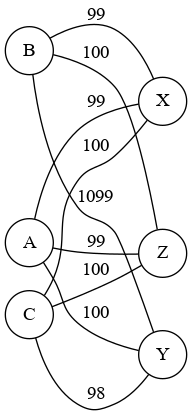

SAE S2.02 -- Rapport pour la ressource Graphes
===

Milleville Paul

Bouin Julien

Lepretre Matys

Version 1
---

Sera évaluée à partir du tag git `Graphes-v1`

### Étude d'un premier exemple
Dans ce premier exemple, Adonia et Callista sont appariables avec tous les italiens car elles n'ont aucune contrainte d'allergie animale.
Adonia a néanmoins une préférence théorique pour Xolag et Zendor grace à des hobbies en commun.
Callista, elle, aura une grosse préférence pour Yak également grace au hobbies.
Bellatrix n'est appariable qu'avec Xolag et Zendor, du fait de la non présence d'animaux dans leur foyer car nous le rappelons, Bellatrix à des contraintes d'allergies. Elle préfèrera également Xolag comme correspondant.

On peut donc conclure ces couples préférés :
- Adonia -> Xolag / Zendor
- Bellatrix -> Xolag
- Callista -> Yak

Pour la répartition, on voit que deux des participantes n'ont qu'un appariement optimal : Bellatix et Callista. On réparti donc les deux assez simplement avec leur préférence. Il ne reste donc que Adonia qui heureusement içi, a comme meilleur choix Zendor qui n'était pas prix pour l'instant.
On a donc un  tri de duo clairement définis et optimal.

### Modélisation de l'exemple

### Modélisation pour la Version 1

Tout d'abord, il faut savoir que la contarinte d'allergie est absolu. C'est à dire que si elle n'est pas validé elle doit empeché l'association de deux candidats. A partir de ce postulat, nous avons mis en place une grille d'évaluation. Toutes les liaisons commencent à 100 points afin d'enlever les résultats négatifs. Ensuite, s'il y a un problème d'allergie nous ajoutons 1000 au poids de la liaison. Puis, si il y a un hobbie commun, on enlève 1 au poids de la relation. On considère donc que plus un poid est proche de zero plus le visiteur et l'hote sont compatibles. 

Version 2
---

Sera évaluée à partir du tag git `Graphes-v2`

### Exemple minimal pour la gestion de l'historique

Dans le tableau suivant, on part du principe que toutes ces personnes n'ont que des critères de type historique.
Pour cet exemple, j'ai pris la Belgique avec Patrice, Sofia, Mila et Henry et l'Allemagne avec Klein, Frantz, Ludwig et Emily.
| Teenager | Pays      |
|----------|-----------|
| Patrice  | Belgique  |
| Sophia   | Belgique  |
| Mila     | Belgique  |
| Henry    | Belgique  |
| Klein    | Allemagne |
| Frantz   | Allemagne |
| Ludwig   | Allemagne |
| Emily    | Allemagne |

Ici, les huit adolescents ont déjà participé à un échange avec un autre adolescent d'un autre pays. La répartition de l'année précédente est la suivante :
Premièrement, nous avons Patrice et Frantz qui se sont mis respectivement same et same.
Deuxièmement, Sophia et Klein qui ont pour leur part attribué respectivement same et other à l'autre.
Troisièmement, Mila et Emily se sont donné respectivement same et non renseigné.
Pour finir, Henry et Ludwig ont choisi d'attribuer à l'autre respectivement other et other.

*Puis, donner un appariement optimal qui tient compte des données d'historique, et expliquer pourquoi il est optimal. L'explication ne doit pas parler des graphes, mais uniquement des adolescents et les critères exprimés.*

Dans l'exemple précisé plus haut, l'appariement optimal sera avec les couples suivants : Patrice avec Frantz, Mila et Emily, Henry avec Klein et pour finir Sophia et Ludwig. En effet, Patrice et Frantz se sont attribué same l'un à l'autre. Ils doivent donc être ensemble. Mila et Emily ont eu aussi un bonus d'affinité avec le same de Mila. Il ne reste que deux couples à former. Les deux contiennent au moins une notation other. On va donc échanger les partenaires comme ceci : Henry avec Klein et Sofia et Ludwig.

### Deuxième exemple pour la gestion d'historique

*Modifiez l'exemple précédent en ajoutant des préférences liées aux passe-temps. Donnez l'appariement que vous considérez optimal dans ce cas. En particulier, expliquez comment vous comptez combiner une éventuelle affinité liée à l'historique avec l'affinité liée aux passe-temps. Rappelons que l'historique peut compter comme une contrainte rédhibitoire ou comme une préférence, voir le sujet pour plus de précisions.*

Dans ce nouvel exemple, nous avons décidé d'ajouter à Patrice et Emily les passe-temps culture et science, à Frantz et Sofia les passe-temps science et reading, à Mila et Klein les passe-temps culture et technologie, et pour finir Henry et Ludwig vont respectivement avoir les passe-temps technologie et sport ainsi que technologie.

*Donner l'appariement que vous considérez optimal dans ce deuxième exemple, toujours sans parler de graphes.*

Ici, l'appariement ne vas pas changer : Patrice avec Frantz, Mila et Emily, Henry avec Klein et pour finir Sophia et Ludwig. Les couples Patrice-Frantz, Mila-Emily et Henry-Klein vont recevoir un bonus d'un passe-temps. Le couple restant ne change pas.

### Modélisation pour les exemples

*Pour chacun des deux exemples précédents, donnez un graphe (donné par sa matrice d'adjacence) tel que l'affectation minimale dans ce graphe correspond à l'appariement optimal identifié plus haut. Expliquez comment vous avez choisi le poids pour chacune des arêtes.*

Exemple 1 :
| Noeud   | Klein | Frantz | Ludwig | Emily | Patrice | Sofia | Mila | Henry |
|---------|-------|--------|--------|-------|---------|-------|------|-------|
| Klein   | 0     | 0      | 0      | 0     | 100     | 1100  | 100  | 100   |
| Frantz  | 0     | 0      | 0      | 0     | 1       | 100   | 100  | 100   |
| Ludwig  | 0     | 0      | 0      | 0     | 100     | 100   | 100  | 1100  |
| Emily   | 0     | 0      | 0      | 0     | 100     | 100   | 50   | 100   |
| Patrice | 100   | 1      | 100    | 100   | 0       | 0     | 0    | 0     |
| Sofia   | 1100  | 100    | 100    | 100   | 0       | 0     | 0    | 0     |
| Mila    | 100   | 100    | 100    | 50    | 0       | 0     | 0    | 0     |
| Henry   | 100   | 100    | 1000   | 100   | 0       | 0     | 0    | 0     |

Exemple 2 : 
| Noeud   | Klein | Frantz | Ludwig | Emily | Patrice | Sofia | Mila | Henry |
|---------|-------|--------|--------|-------|---------|-------|------|-------|
| Klein   | 0     | 0      | 0      | 0     | 99      | 1100  | 98   | 99    |
| Frantz  | 0     | 0      | 0      | 0     | 0       | 98    | 100  | 100   |
| Ludwig  | 0     | 0      | 0      | 0     | 100     | 100   | 99   | 1100  |
| Emily   | 0     | 0      | 0      | 0     | 98      | 99    | 49   | 100   |
| Patrice | 99    | 0      | 100    | 98    | 0       | 0     | 0    | 0     |
| Sofia   | 1100  | 98     | 100    | 99    | 0       | 0     | 0    | 0     |
| Mila    | 98    | 100    | 99     | 49    | 0       | 0     | 0    | 0     |
| Henry   | 99    | 100    | 1100   | 100   | 0       | 0     | 0    | 0     |

### Modélisation pour l'historique de la Version 2

*Décrire une modélisation générale pour la Version 1. C'est à dire, donner une formule ou une description précise qui décrit comment, étant donné un adolescent hôte et un adolescent visiteur, on détermine le poids de l'arête entre ces deux adolescents en fonction des critères considérés dans la Version 1. Décrire également comment vous construisez le graphe modèle à partir des données en entrée.*

Lors de la version 1, on évaluait l'aspect compatible des deux Teenager, donc s'il n'y avait aucun un problème d'allergie animale auquel cas on applique la clause rédhibitoire (+1000). Par la suite, on enlève au poids total le nombre de passe-temps commun.
Le Graphe est lui, construit avec des couples de Teenager (à l'aide de la classe Couple) depuis deux listes de Teenager, l'une pour les visiteurs et l'autre pour ceux qui héberge. Pour chaque visiteur, on a autant de liaisons que de personne qui héberge.

### Implémentation de l'historique de la Version 2

*Quelles fonctions de votre code avez-vous modifié pour prendre en compte le critère historique ? Donnez ici les noms des méthodes (et leur classe), à quoi elles servent, et quelles modifications vous avez apportées. Essayez d'être synthétique.*

Pour l'intégration de la gestion de l'historique, nous avons créé une classe à part entière qui s'appelle Affectation. Elle contient une HashMap de clé et de valeur de type Teenager. On y retrouve toute les fonctions de base permettant le calcul du coût de l'historique (history, equalsCriterion(de la classe Teenager), isAffecter (de la classe Affectation) et getCurrentTeenager(de la classe Affectation)). Nous avons également modifié la fonctions weight ainsi qu'ajouter en paramètre au fonctions creationsGraphes, et au constructeur de la classe Couple (pour le calcul du poids de chaque couple).

### Prendre en compte les autres préférences

*Pour chacun des autres critères d'affinité que vous décidez de prendre en compte, décrire comment vous changez la fonction weight de la classe AffectationUtil.*

Pour ce qui est des derniers critères d'affinité, il ne nous reste que les préférences de Genre et de différence d'âge.
Pour le genre, on test pour les deux Teenagers tout d'abord la présence de critères dans requirements, puis on étudie la présence d'un critère de genre dans requirements, puis si effectivement il y un critère correspondant pour l'un ou pour l'autre, on regarde si ce critère correspond au genre de l'autre Teenager. Si toutes ces conditions sont remplies, on enlève 1 au poids total. S'il y a un critère Gender, mais s'il n'est pas respecté, on ajoute 1 à ce même poids.
Pour la différence d'âge, on compare l'anniversaire des deux Teenager, on regarde si la différence entre les deux dates est inférieur à un an et demi. Si c'est le cas, on enlève 1 au poids total.

